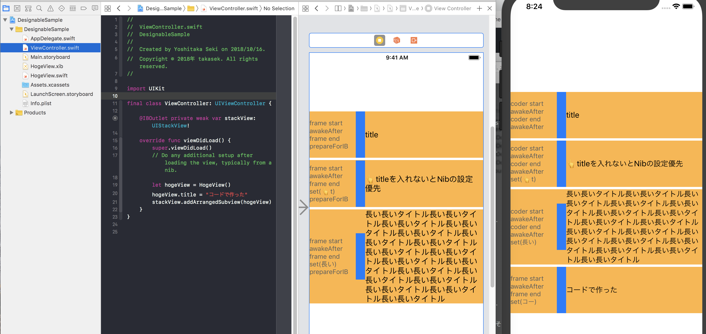

# DesignableSample

## プロジェクトの目的

1. xibでデザインしたViewのサブクラスを、Storyboardあるいはxibから利用する方法を示す
2. xibあるいはコードでinitされたViewが内部的に呼ぶメソッドのライフサイクルの調査

## わかったこと

IBでレイアウトされているなら `init(coder:)` で、コードでinitされたなら `init(frame:)` だと思い込んでいたが、違った。

初期化経路 | 実行環境 | 呼ばれるinit
--- | --- | ---
コード | Any | `init(frame:)`
Interface Builder | Xcode上で開く | `init(frame:)`
Interface Builder | アプリ実行時 | `init(coder:)`

証拠画像はこちら

